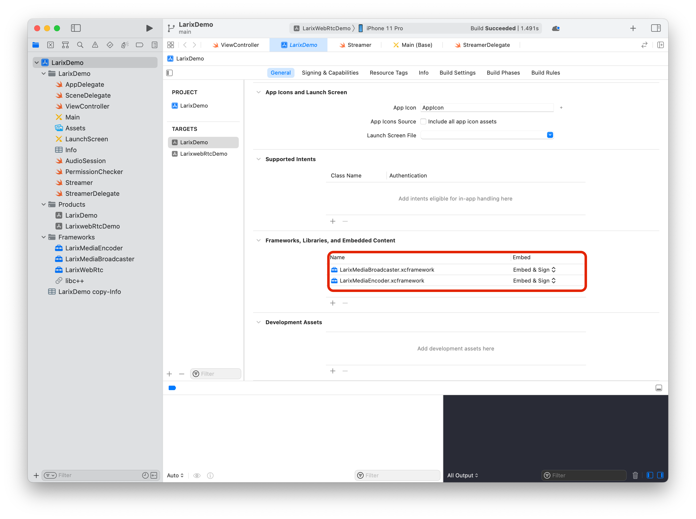

# iOS Streaming App step-by-step

## Project creation
In XCode, choose File/New/Project, select iOS/App. On next step, specify Product name, Team, Organizaton and Bundle identifier. Below, set Interface to Storyboard and language to Swift. Using Core data is up to you - you may use it to store settings or use some other framework (e.g. Larix Streamer is using GRDB). 


On next step, specify project location (XCode will create folder with product name for you).
Copy needed .xcframework files to project directory

## Project settings
Select project file in XCode Project navigator, then select item in Targets secion. On General tab, scroll down to "Frameworks, Libraries and Embedded Content" section. Add mbl.xcframework (click Plus sign below, then choose "Add Files" from "Add Other" drop-down in a bottom, specify libmbl2.a file).
Depnding on needed protocol support, you can choose either version with only RTMP and RTSP protocols (mbl\_tcp.xcframework), or variant with SRT or RIST support in addition to RTMP/RTSP (mbl\_srt.xcframework or mbl\_rist.xcframework for one of them or mbl.xcframework for both).
For SRT and RIST support you also must add libsrt.xcframework or librist.xcframework accordingly. For SRT you also need libcrypto.xcframework and libc++.tbd 



### Bridging header
Create file YourProject-Brigding-Header.h and put following line to it

`#import "mbl-iOS/mbl.h"`


Then in project settings go to "Build Settings" tab, scroll down to "Swift Compiler - General" and specify above file name in "Objective-C Bridging Header" line. 


### Application properties
Open Info.plist in the Project Navigator, and add following lines:

| Key                                    | Value                      |
|----------------------------------------|----------------------------|
| Privacy - Camera Usage Description     | Used for live broadcasting |
| Privacy - Microphone Usage Description | Used for live broadcasting |

Instead of "Used for live broadcasting" you may use any other description you find appropriate.


## Audio Session
Any application that record or play audio, must activate AVAudioSession.
Perform following code on start of the application:

```
let session = AVAudioSession.sharedInstance()
do {

    try session.setCategory(.playAndRecord, mode: .videoRecording, options: [.allowBluetooth])
    try session.setActive(true)
} catch {
 /* Handle error */
}
```

You should also handle `AVAudioSession` session events: `interruptionNotification`, `mediaServicesWereLostNotification` and `mediaServicesWereResetNotification`. 

LarixDemo has `AVAudioSession`-related logic in AudioSession.swift

See [Deveoper documentation](https://developer.apple.com/documentation/avfoundation/avaudiosession) for more information about AVAudioSession

# Request permissions

Check is access to camera and microphone granted by calling `AVCaptureDevice.authorizationStatus(for: AVMediaType)` with audio/video parameter: 

```
let audioStatus = AVCaptureDevice.authorizationStatus(for: AVMediaType.audio)
let videoStatus = AVCaptureDevice.authorizationStatus(for: AVMediaType.video)
if audioStatus == .authorized && videoStatus == .authorized {
// Intialize capture session
} else if videoStatus == .notDetermined {
    AVCaptureDevice.requestAccess(for: AVMediaType.video, completionHandler: onRequestResult)
} else if audioStatus == .notDetermined {
    AVCaptureDevice.requestAccess(for: AVMediaType.audio, completionHandler: onRequestResult)
}

...
func onRequestResult(granted: Bool) {
...
}

```

LarixDemo holds permissions check in PermissionChecker.swift

See [Developer documentation](https://developer.apple.com/documentation/avfoundation/cameras_and_media_capture/requesting_authorization_for_media_capture_on_ios) for details of media capture permissions


# Setup AVCaptureSession
 
You must create `AVCaptureSession`, then obtain `AVCaptureDevice` for audio and video, configure it and connect to seesion

```
func createSession() -> AVCaptureSession? throws
    let session = AVCaptureSession()
    //Setup audio
    guard let mic = AVCaptureDevice.default(for: AVMediaType.audio) else { return nil }
    guard let audioIn = try? AVCaptureDeviceInput(device: recordDevice!) else { return nil }
        
    if session.canAddInput(audioIn) {
        session.addInput(audioIn)
    } else {
			return nil
    }
        
    let audioOut = AVCaptureAudioDataOutput()
    // Will receive captureOutput with audio sample buffers
    audioOut.setSampleBufferDelegate(self, queue: workQueue)
       
    if session.canAddOutput(audioOut) {
        session.addOutput(audioOut)
    } else {
        return nil
    }
		
	//Setup video; get standard (wide angle) back camera
    guard let camera = AVCaptureDevice.default(.builtInWideAngleCamera, for: .video, position: .back) else { return nil }
        
    let videoIn = try? AVCaptureDeviceInput(device: camera) else {return nil}
    if session.canAddInput(videoIn) {
        session.addInput(videoIn)
    } else {
        return nil
    }

    if !setCameraParams(camera) { return nil }

    let videoOut = AVCaptureVideoDataOutput()
    // Will receive captureOutput with video sample buffers
    videoOut.setSampleBufferDelegate(self, queue: workQueue)
    if session.canAddOutput(videoOut) {
        session.addOutput(videoOut)
    } else {
        return nil
    }
        
   return session
     
}

```

You can see capture session setup in Streamer.swift: see `startCapture` and functions it calls: `setupAudio`, `setupVideoIn` and `setupVideoOut`.

Then you must subscribe to receive capture session notifications, `AVCaptureSessionDidStartRunning` and `AVCaptureSessionRuntimeError`, as well as `AVCaptureSessionWasInterrupted` and `AVCaptureSessionInterruptionEnded` to handle capture session interruption.
See `registerForNotifications` function for detais.

When session is start running, create preview layer with AVCaptureSession

```
let previewLayer = AVCaptureVideoPreviewLayer(session: session)
previewLayer.frame = .frame
previewLayer.videoGravity = AVLayerVideoGravity.resizeAspectFill
view.layer.addSublayer(preview)

```

In LarixDemo, you can see it in `ViewController.onCaptureStateChange`, which is initiated by `Streamer.sessionDidStartRunning`, handler of `AVCaptureSessionDidStartRunning` event. 


Read [Developer documenteration](https://developer.apple.com/documentation/avfoundation/cameras_and_media_capture/avcam_building_a_camera_app) for more details of camera setup


## Broadcasting library setup
You should create `StreamerEngineProxy` instance to communicate with the streaming library and create queue for frame handling

```
let engine = StreamerEngineProxy()
let workQueue = DispatchQueue(label: "StreamingQueue")

```

In Streamer.swift there is utility singleton class `StreamerSingleton` to hold StreamerEngineProxy and DispatchQueue references.
Implement `StreamerEngineDelegate` protocol and call `engine.setDelegate` to receive notifications.

Start encoding of audio and video frames by calling `engine.setAudioConfig` and `engine.setVideoConfig` with encoding parameters. Then call `engine.startVideoEncoding()` to actually initialize encoding session. Notice there is no `startAudioEncoding` - it will be activated automatically when engine will receive first audio frame.

On receiving frames in captureOutput handler, you should send audio frames to engine by calling `engine.didOutputAudioSampleBuffer()`. For video, call `engine.didOutputVideoSampleBuffer`. You may also perform some manipulations on video frames (rotation, adding overlays etc.) and send `CVPixelBuffer` by `engine.didOutputVideoPixelBuffer()`

Create connection to server by calling `engine.createConnection` for RTMP/RTSP connectoin, `engine.createSrtConnection` for SRT connection and `engine.createRistConnection` connecton for RIST connection. Notice that SRT/RIST functons are available even on library without protocol support, but connection will fail.
You may create as many simultaneous connections as you need, just mind network bandwidth.

